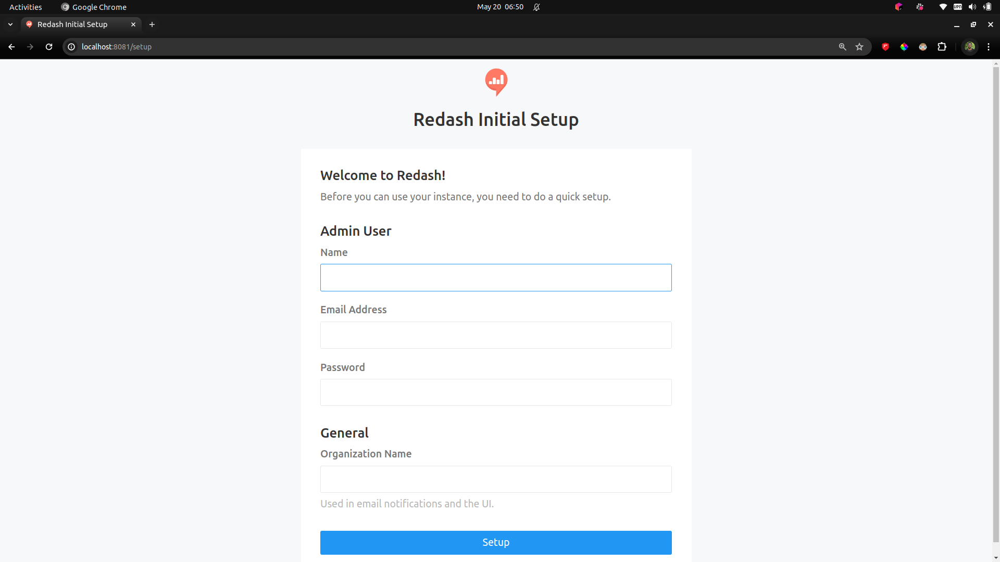
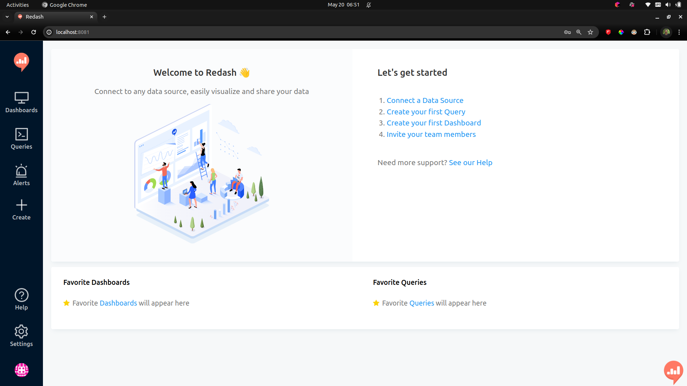
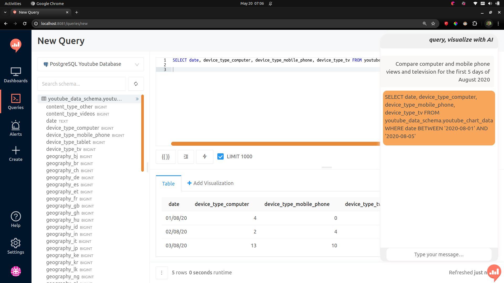
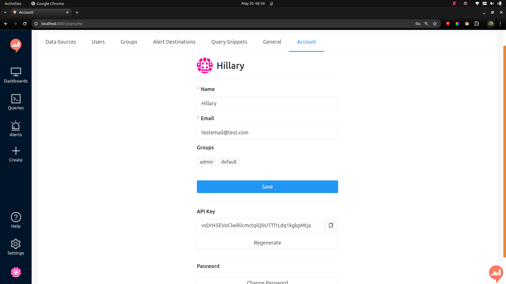

## Introduction

The Redash Chatbot LLM is an innovative integration that brings the power of OpenAI's ChatGPT model to your Redash dashboard. This integration allows users to interact with their Redash dashboards using natural language queries, making data exploration and analysis more intuitive and user-friendly. The Redash Chatbot LLM plugin provides conversational query capabilities, automated data visualization, and seamless integration with Redash. The project leverages Docker for easy setup and deployment, making it easy for users to get started with the integration.

## Features

- **Conversational Queries**: The integration allows users to interact with their Redash dashboards using natural language queries. This makes the process of data exploration and analysis more intuitive and user-friendly.

- **Automated data Visualization**: The integration allows users to visualize query results directly within the chat interface. This feature enables faster data exploration and analysis.

- **Integration with Redash**: The project is designed to work seamlessly with Redash, allowing users to leverage the full power of this popular open-source data visualization tool.

- **Docker Support**: The project leverages Docker for easy setup and deployment. This makes it easy for users to get the project up and running on their own systems.

## Requirements Before Installation
  - Docker: This is used for creating, deploying, and running applications by using containers.
  - Docker Compose: This is a tool for defining and managing multi-container Docker applications.
  - Node.js: This is a JavaScript runtime built on Chrome's V8 JavaScript engine.
  - Yarn: This is a package manager that doubles down as project manager.
  - Python: The project requires a Python version that is greater than or equal to 3.9 and less than or equal to 3.10.2.
  - Poetry: This is a tool for dependency management and packaging in Python.

### Setup and Installation
1. **Clone the Repository**
    ```bash
    git clone git@github.com:10ac-group10/Redash_Chatbot_LLM.git
    cd Redash_Chatbot_LLM
    ```

2. **Create a Virtual Environment and Install Dependencies**
```bash
python3.10 -m venv venv
source venv/bin/activate  # For Unix or MacOS
venv\Scripts\activate     # For Windows
pip install -r requirements.txt
```

3. **Install the frontend dependencies**
    ```bash
    poetry add openai
    ```

    ```bash
    yarn add react-icons
    ```

    ```bash
    yarn add react-syntax-highlighter
    ```


4. **Environment Variables**
    - Create a `.env` file in the root directory and add the following environment variables:
    ```bash
    OPENAI_API_KEY=your_openai_api_key
    ```
    - Replace `your_openai_api_key` with your OpenAI API key.
    - **Get your free OpenAI API key** - [OpenAI](https://platform.openai.com/)
    - **Note:** Follow the best practices by not commiting the .env file to the repository.

5. **Build the application**

   - Run the following commands to get the container up and running and start the application:

      ```bash
      yarn
      ```
      ```bash
      make build
      ```
      ```bash
      make compose_build
      ```
      ```bash
     make up
      ```

   - If running all the above commands successfully, in future you can then simplify the process by running the below command to start the application.

        ```bash
      make run
        ```

6. **Access the Application**
   - Open your browser and navigate to `http://localhost:8081` to access the Redash homepage.

   - **Note**: The port 8081 is access to Nginx, which is the reverse proxy server for the Redash application. The Redash application runs on port 5000, but it is not directly accessible from the browser. The Nginx server acts as a reverse proxy server that forwards requests from the browser to the Redash application running on port 5000.

7. **Login to Redash**
   - After accessing the Redash setup page, you will be prompted to sign up.
   - Here is how the redash setup page looks like:
   
   - Fill in the required details and click on the `Setup` button to create an account.

8. **Explore the Redash homepage**
   - After creating an account, you will be redirected to the Redash homepage.
   - Here is how the Redash homepage looks like:
   
   - You can explore the Redash homepage and familiarize yourself with the different features and functionalities available.
   - **Note**: The Redash Chatbot LLM plugin is integrated into the Redash interface, allowing users to interact with ChatGPT directly from the chat interface.
   - The chatbot icon is located at the bottom right corner of the page. Click on the icon to open the chat interface and start interacting with ChatGPT.
   - After submitting a question, the chatbot will return a query result in the chat interface. Here's an example of a chatbot response displaying a query:
   
   - **Note**: We have get the redash api key and create data source for automated visualizations. These will be done in the next steps.

9. **Get the Redash API Key**
   - After creating an account, you will be redirected to the Redash homepage.
   - Click on the settings icon at the bottom left corner of the page.
   - Navigate to the `Account` tab.
   
   - Copy the API key and save it in a secure location.
   - **Note**: The API key is required for making API requests to the Redash server.
   - Locate the `.env` file and add the `REDASH_API_KEY` environment variable with the copied API key.
   ```bash
    REDASH_API_KEY=your_redash_api_key
   ```

10. **Create a Data Source**
    - To create a data source, click on the settings icon at the bottom left corner of the page.
    - Navigate to the `Data Sources` tab.
    - Click on the `New Data Source` button.
    - Select the appropriate data source type (e.g., PostgreSQL, MySQL, etc.).
    - Fill in the required details for the data source configuration.
    - Click on the `Save` button to create the data source.
    - Click on the `Test Connection` button to verify that the data source is connected successfully.
    - **Note**: The data source is required for querying and visualizing data in Redash. The Redash Chatbot LLM plugin allows users to interact with ChatGPT to generate queries and visualize the results directly within the chat interface.


Now you have successfully set up the Redash Chatbot LLM plugin and can start interacting with ChatGPT to query and visualize data in Redash.

## Conclusion
The Redash Chatbot LLM plugin is an innovative integration that enhances the user experience by providing natural language conversation capabilities powered by ChatGPT. With the plugin, users can engage in interactive queries, receive informative responses, and visualize data directly within the chat interface. This integration streamlines the data exploration and analysis process, making it more intuitive and user-friendly. By following the installation steps outlined in this guide, you can set up the Redash Chatbot LLM plugin and start leveraging the power of ChatGPT in your Redash dashboard.

## References
- [Redash ChatGPT Plugin by *Rehmet Yeshanew*](https://github.com/RYees/redash-chatgpt-plugin?tab=readme-ov-file)
- [Redash API Client](https://github.com/damienzeng73/redash-api-client)
- [OpenAI API Documentation](https://beta.openai.com/docs/)
- [Asynchronous with OpenAI and Celery in Redash](https://github.com/RYees/Asynchronous_OpenAI_-Streaming_Execution)
- [Langchain LLM integration](https://python.langchain.com/v0.1/docs/integrations/llms/openai/)


## License
This project is licensed under the MIT License - see the [LICENSE](LICENSE) file for details.
```
